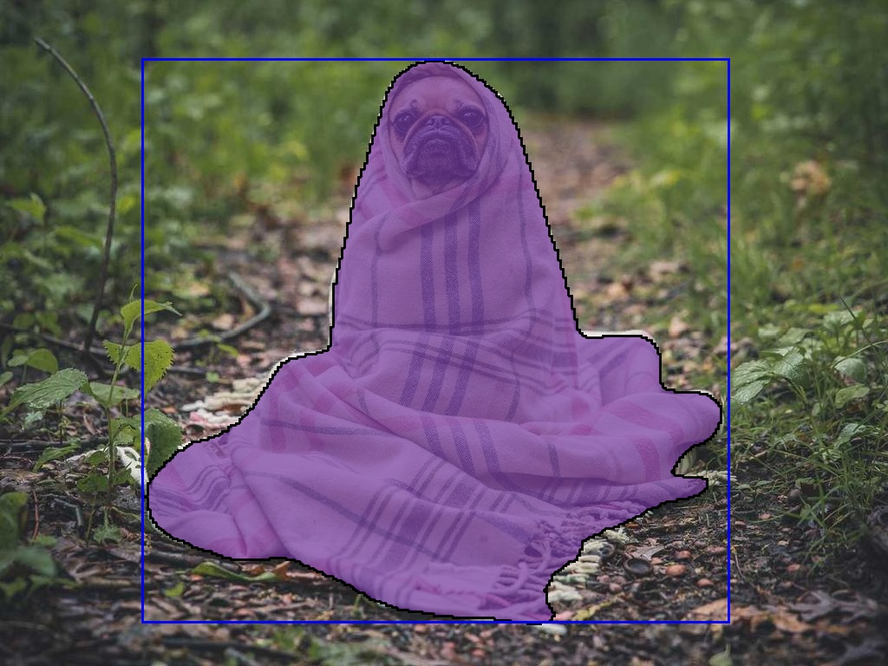
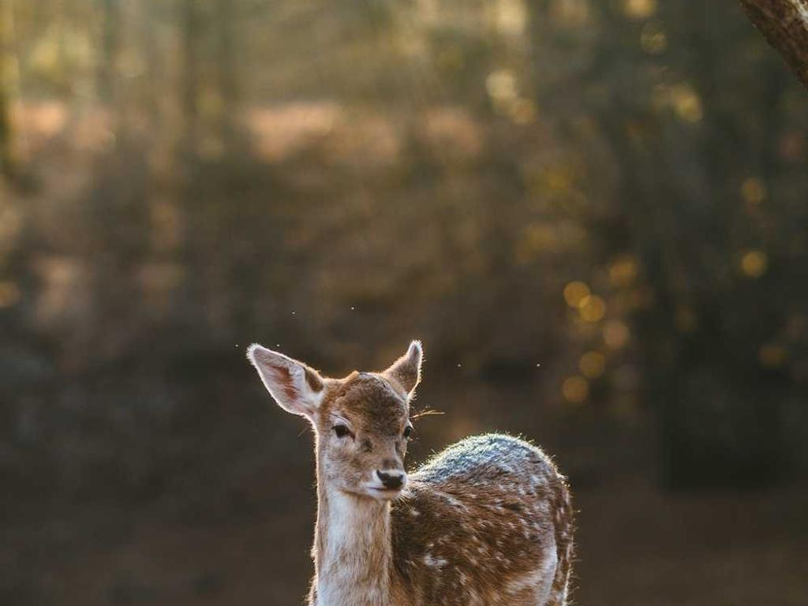
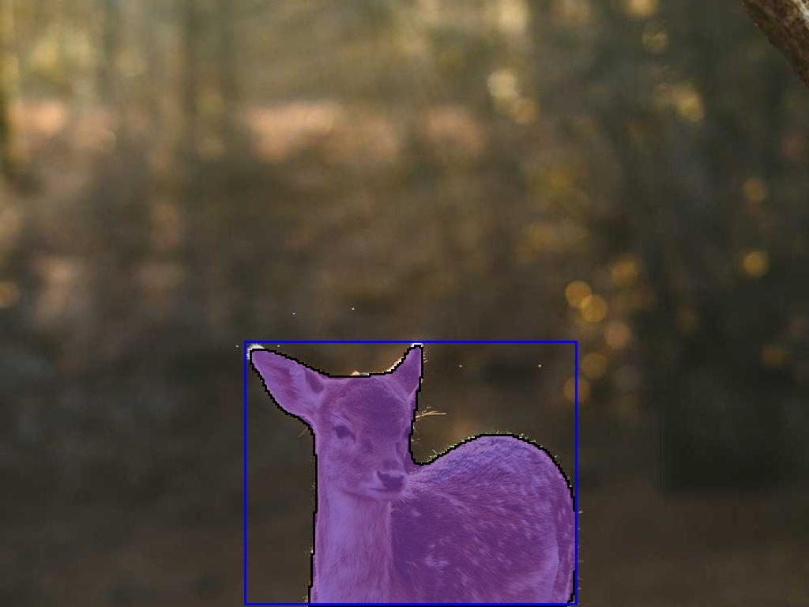
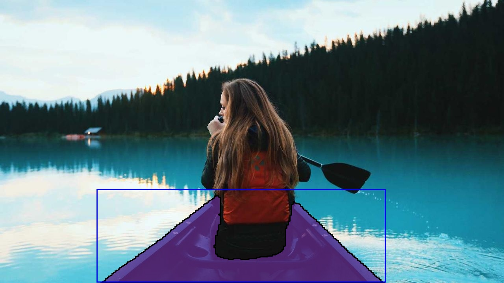
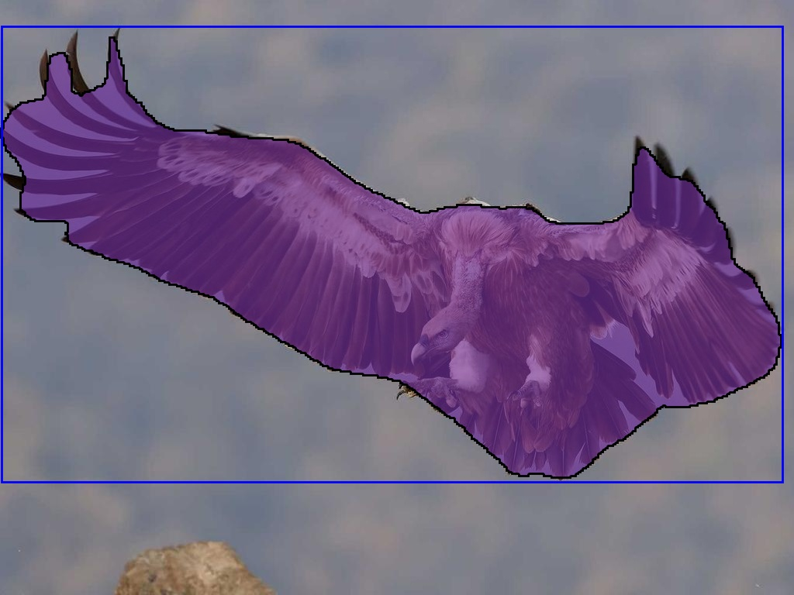
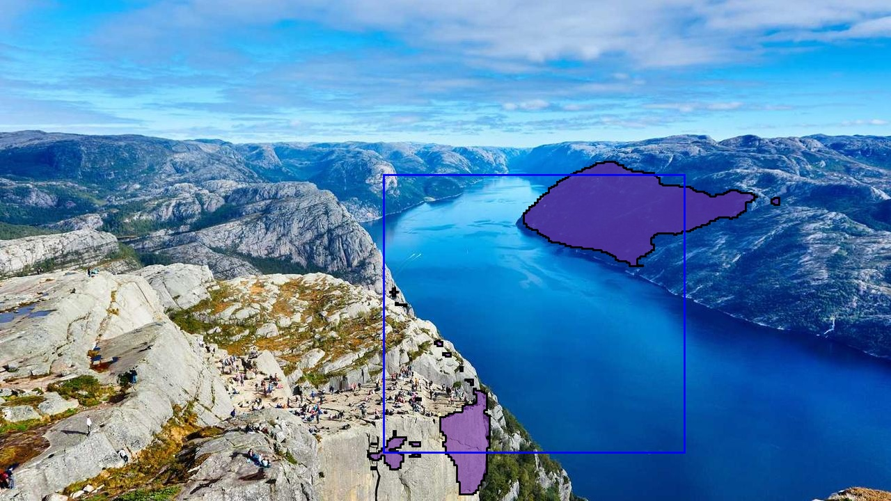

# C3VG Demo 使用示例

## 环境配置
###  创建并激活
conda create -y -n c3vg python=3.9
conda activate c3vg
pip install --upgrade pip

###  安装 PyTorch CPU
pip install torch==2.0.0 torchvision==0.15.0 --index-url https://download.pytorch.org/whl/cpu

###  安装 mmcv-full（CPU 对应 torch2.0.0）
pip install mmcv-full==1.7.2 -f https://download.openmmlab.com/mmcv/dist/cpu/torch2.0.0/index.html

### 先移除有冲突的包
pip uninstall -y timm torchscale

### 安装兼容版本
pip install torchscale==0.3.0 timm==0.6.13

### 安装其余依赖（去掉 timm/torchscale，避免再次回退）
pip install mmdet==2.28.1 numpy pillow opencv-python pycocotools transformers \
  fairscale einops torchmetrics sentencepiece fvcore cloudpickle omegaconf pandas

### 安装 detectron2（用于可视化 GenericMask/VisImage）
python -m pip install 'git+https://github.com/facebookresearch/detectron2.git'

## **实际上在环境设置的时候**
- 遇到了诸多问题，包冲突非常多，这里选择使用环境文件c3vg-env.yml，便于复现环境：
```bash
conda env create -f /home/yinchao/C3VG/c3vg-env.yml
```

**注意导出环境文件的命令如下示例**
```bash
conda env export -n c3vg > /home/yinchao/C3VG/c3vg-env.yml
```
**注意导出并保存环境安装清单的命令如下示例**
```bash
cd /home/yinchao/C3VG && conda list -n c3vg > c3vg-conda-list.txt && /home/yinchao/anaconda3/envs/c3vg/bin/pip freeze > c3vg-pip-freeze.txt
```
- 而c3vg-pip-freeze.txt文件包含了环境所安装的所有内容。

## 创建文件夹并下载文件
```bash
mkdir pretrain_weights
```
```bash
cd /home/yinchao/C3VG/pretrain_weights
```
```bash
wget https://github.com/addf400/files/releases/download/beit3/beit3.spm
```
在本地电脑安装model.pth文件：
```
https://seunic-my.sharepoint.cn/personal/230238525_seu_edu_cn/_layouts/15/onedrive.aspx?id=%2Fpersonal%2F230238525%5Fseu%5Fedu%5Fcn%2FDocuments%2FC3VG%2Dretrain%2Ezip&parent=%2Fpersonal%2F230238525%5Fseu%5Fedu%5Fcn%2FDocuments&ga=1
```
```bash
yinchao@yinchaodeMacBook-Air ~ % cd Desktop                             
yinchao@yinchaodeMacBook-Air Desktop % scp model.pth yinchao@iaaccn44:/home/yinchao/C3VG/pretrain_weights
```

下面若安装了model.pth，则不必要安装
```bash
wget https://github.com/addf400/files/releases/download/beit3/beit3_large_patch16_224.pth
```

## 示例运行
```bash
python demo.py \
  --input_image_path /home/yinchao/C3VG/images/dog.jpg \
  --prompt "a dog" \
  --output_image_path /home/yinchao/C3VG/vis/vis_dog.jpg \
  --config /home/yinchao/C3VG/configs/C3VG-Mix.py \
  --checkpoint /home/yinchao/C3VG/pretrain_weights/model.pth \
  --device cpu
```

```bash
python demo.py \
  --input_image_path /home/yinchao/C3VG/images/dear.jpg \
  --prompt "a dear" \
  --output_image_path /home/yinchao/C3VG/vis/vis_dear.jpg \
  --config /home/yinchao/C3VG/configs/C3VG-Mix.py \
  --checkpoint /home/yinchao/C3VG/pretrain_weights/model.pth \
  --device cpu
```

```bash
python demo.py \
  --input_image_path /home/yinchao/C3VG/images/boat.jpg \
  --prompt "a boat" \
  --output_image_path /home/yinchao/C3VG/vis/vis_boat.jpg \
  --config /home/yinchao/C3VG/configs/C3VG-Mix.py \
  --checkpoint /home/yinchao/C3VG/pretrain_weights/model.pth \
  --device cpu
```

```bash
python demo.py \
  --input_image_path /home/yinchao/C3VG/images/eagle.jpg \
  --prompt "a eagle" \
  --output_image_path /home/yinchao/C3VG/vis/vis_eagle.jpg \
  --config /home/yinchao/C3VG/configs/C3VG-Mix.py \
  --checkpoint /home/yinchao/C3VG/pretrain_weights/model.pth \
  --device cpu
```

```bash
python demo.py \
  --input_image_path /home/yinchao/C3VG/images/mountain.jpg \
  --prompt "a mountain" \
  --output_image_path /home/yinchao/C3VG/vis/vis_mountain.jpg \
  --config /home/yinchao/C3VG/configs/C3VG-Mix.py \
  --checkpoint /home/yinchao/C3VG/pretrain_weights/model.pth \
  --device cpu
```


## 运行结果示例图

<table>
  <thead>
    <tr>
      <th>原图</th>
      <th>可视化</th>
    </tr>
  </thead>
  <tbody>
    <tr>
      <td></td>
      <td></td>
    </tr>
    <tr>
      <td></td>
      <td></td>
    </tr>
    <tr>
      <td></td>
      <td></td>
    </tr>
    <tr>
      <td></td>
      <td></td>
    </tr>
    <tr>
      <td></td>
      <td></td>
    </tr>
  </tbody>
</table>
